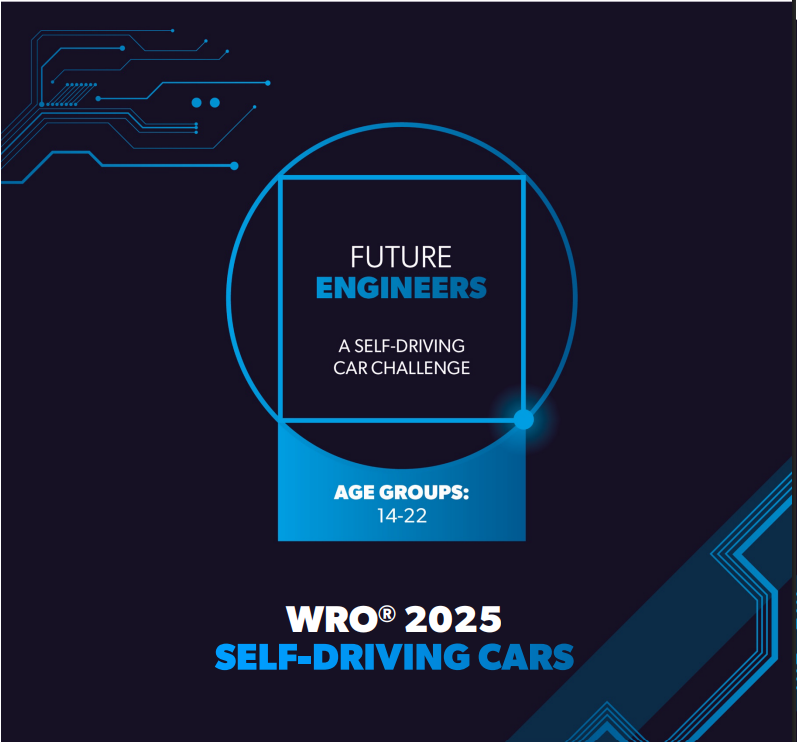

# Robaco Future Engineers 2025
This repository showcases the development of an autonomous vehicle created by a student team from Guatemala for the 2025 WRO Future Engineers challenge. The project combines design, programming, and innovation as part of the team's preparation for the event.
## Content
* `Future Engineers Challenge`
* `T-Photos` 
* `V-Photos` 
* `Video` 
* `Schemes` 
* `Src` 
* `Models` 
* `Other`
  
## Future Engineers Challenge 

  

In the 2025 edition of the World Robot Olympiad, the Future Engineers category centers on the development of an autonomous vehicle capable of adapting to an ever-changing racetrack environment. Competitors must engineer a robot that can complete multiple laps while skillfully avoiding obstacles that are repositioned each round. A significant aspect of the challenge is the requirement for the robot to execute a parallel parking task with high accuracy, reflecting real-world vehicle maneuvers.

Success in this competition demands the integration of sophisticated robotics disciplines, including but not limited to sensor data processing, environment perception, and precise motion planning. Participants are encouraged to focus on crafting innovative solutions that demonstrate both technical excellence and dependability under varying conditions.

Moreover, teams are expected to maintain detailed documentation showcasing their engineering journey — from design concepts and programming decisions to testing outcomes — ideally shared openly on platforms like GitHub. This practice not only reinforces transparency but also fosters collaborative learning within the robotics community.

Judges evaluate each entry by assessing how effectively the robot performs during the trials, the thoroughness and professionalism of the documentation, and the creativity and robustness of the overall approach. The challenge aims to inspire young engineers to apply theoretical knowledge in practical scenarios, emphasizing teamwork, problem-solving, and continuous innovation.

For more detailed information, please visit the official [WRO website](https://wro-association.org/).

## T-Photos
